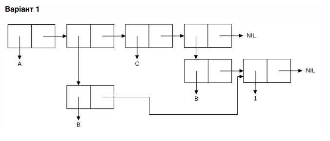

<p align="center"><b>МОНУ НТУУ КПІ ім. Ігоря Сікорського ФПМ СПіСКС</b></p>
<p align="center">
<b>Звіт з лабораторної роботи 1</b><br/>
"Обробка списків з використанням базових функцій"<br/>
дисципліни "Вступ до функціонального програмування"
</p>

<p align="right"> 
<b>Студент</b>: 
<em> Бахурінський Олександр КВ-12</em></p>

<p align="right"><b>Рік</b>: <em>2024</em></p>

## Загальне завдання

```lisp
;; Пункт 1 (створення списку)
CL-USER> (setq mylist (list 1 'a '(1 2) 'b  (list)))
(1 A (1 2) B NIL)

;; Пункт 2 (отримання голови списку)
CL-USER> (car mylist)
1
    ;або
CL-USER> (nth 0 mylist)
1    
;; Пункт 3 (отримання хвоста списку)
CL-USER> (cdr mylist)
(С (2 3) B NIL)
    ;або
CL-USER> (nthcdr 1 mylist)
(С (2 3) B NIL)

;; Пункт 4 (отримання третього елемента списку)
CL-USER> (third mylist)
(2 3)
    ;або
CL-USER> (nth 2 mylist)
(2 3)

;; Пункт 5 (отримання останнього елемента списку)
CL-USER> (car (last mylist))
NIL

;; Пункт 6 (Використання предикатів ATOM та LISTP)
;;ATOM
CL-USER> (atom nil)
T
CL-USER> (atom 2)
T
CL-USER> (atom '(2))
NIL

;;LISTP
CL-USER> (listp mylist)
T
CL-USER> (listp '(1 2))
T
CL-USER> (listp 1)
NIL
CL-USER> (listp nil)
T
;; Пункт 7 (Використання інших предикатів)
;;ZEROP
CL-USER> (zerop 5)
NIL
CL-USER> (zerop 0)
T

;;ODDP
CL-USER> (oddp 5)
T
CL-USER> (oddp 4)

;;NUMBERP
CL-USER> (numberp mylist)
NIL
CL-USER> (numberp 1)
T

;; Пункт 8 (Об'єднання списку із підсписком)

CL-USER> (setq mylist (list 1 'с '(2 3) 'b  (list)))
(1 С (2 3) B NIL)
CL-USER> (append  mylist (nth 2 mylist))
(1 С (2 3) B NIL 2 3)
```

## Варіант 1
<p align="center"></p>

### Лістинг команди конструювання списку та результат її виконанння
```lisp
CL-USER> (let ((x (list 'b 1))) ;перша форма
    ;;друга форма, що містить підсписки
     (list (list 'A x 'C x)))
     
((A (B 1) C (B 1))) ;результат виконання
```# Functional_programming_Common_Lisp
